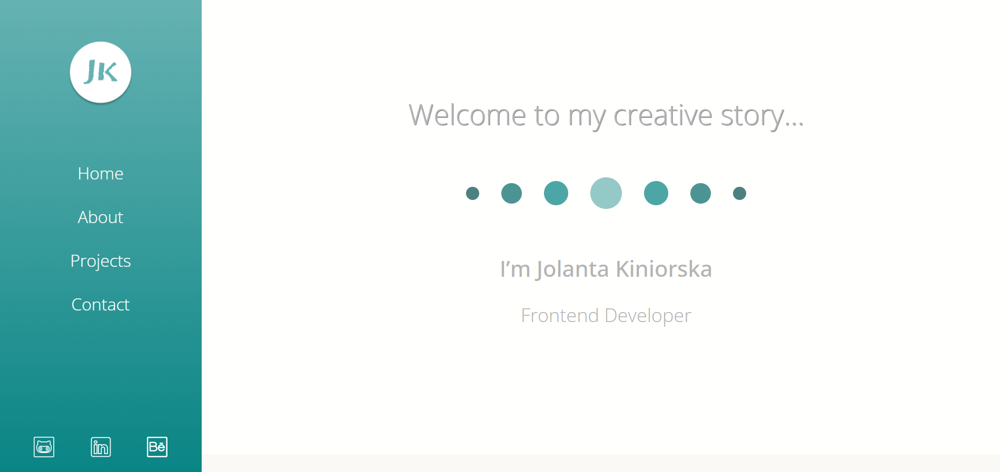

# Portfolio page

Portfolio is a place where I have included most of the applications and websites I have created. I invite you to see my projects. Have fun!

## Table of contents

- [General info](#general-info)
- [Technologies](#technologies)
- [Website url](#website-url)
- [Website screenshot](#website-screenshots)

## General info

- portfolio page is built on react components
- consists of 5 sections: home, about, projects, contact and footers
- it is possible to navigate the site using the menu
- the most important section is the projects section, where you can see the applications and websites I have created - code in github and website url
- portfolio is available on desktop and mobile and is a responsive website

## Technologies

Project is created with:

- React.js
- React Router
- TypeScript
- JavaScript
- CSS
- Sass

## Website url

[Portfolio Page](https://jola-kiniorska.github.io/)

## Website screenshot

